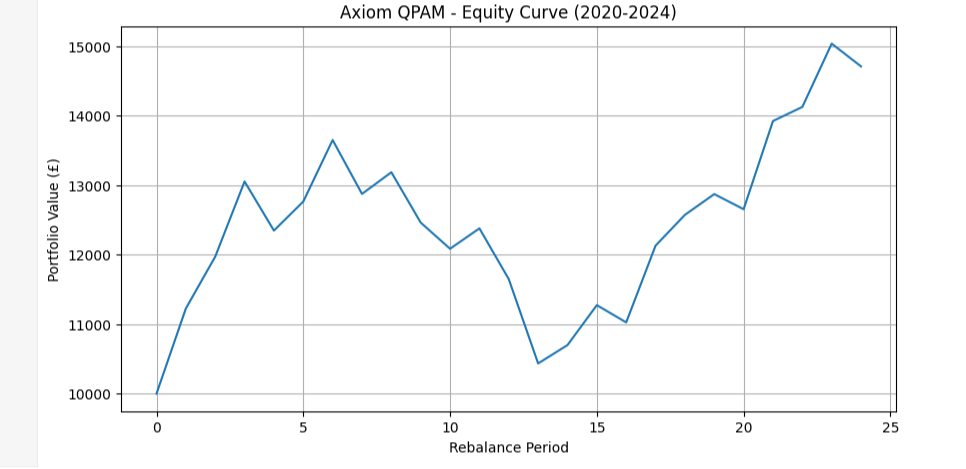

<!DOCTYPE html>
<html>
<head>
    
</head>
<body>
    

        <h1>Axiom QPAM: Initial Backtest Complete</h1>
        

            <strong>Date:</strong> 15 December 2024 | 
            <strong>Status:</strong> Validation Phase Passed
        

    

    

        <h2>Backtest Results (Jan 2020 - Nov 2024)</h2>
        
        

            

                
1.04

                
Sharpe Ratio

            

            

                
-23.56%

                
Max Drawdown

            

            

                
+47.1%

                
Total Return

            

            

                
£14,710

                
Final Value

            

        

        
        
<strong>Analysis:</strong> The model demonstrates positive risk-adjusted returns (Sharpe > 1.0) and survives major market volatility (Max DD < -25%). The results validate the core multi-factor logic.

    

    

        <h2>Equity Curve</h2>
        
        
<em>Portfolio growth from £10,000 to £14,710 (2020-2024)</em>

    

    

        <h2>Next Research Phase</h2>
        <ul>
            <li>Detailed performance attribution & factor analysis</li>
            <li>Transaction cost & slippage modeling</li>
            <li>Preparation of full Investment Memorandum (Q1 2026)</li>
            <li>Live paper trading implementation</li>
        </ul>
    

    

        
Axiom Capital Research • <a href="/">Return to Home</a> • <a href="https://github.com/wannabequantcmugz" target="_blank">GitHub</a>

        
<em>Independent systematic finance research</em>

    

</body>
</html>
